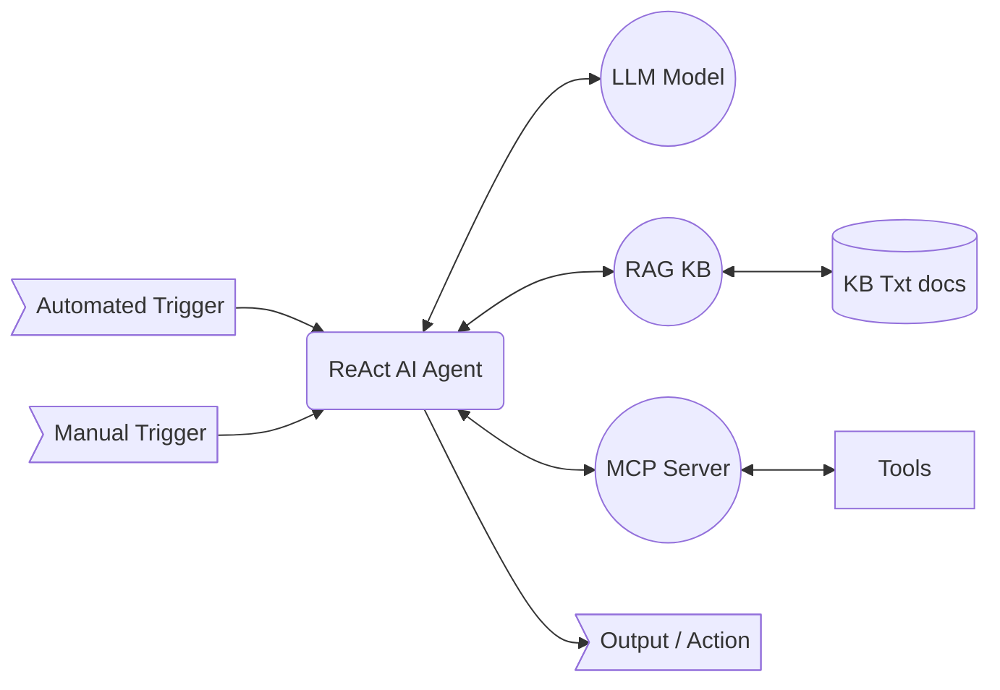

# Reasoning Diagnostic Agent

Technology demonstration PoC of an **AI agent** using **LLM**-based **reasoning** to perform complex tasks: generate an execution plan from external inputs and a knowledge base, collect relevant external data via integrated tools, evaluate if the goal has been achieved, and deliver actionable conclusions—powered by **Ollama** with **open-source models**.

### The Problem

Cloud services generate thousands of alerts daily. Most are noisy, repetitive, or context dependent, requiring human triage and investigation. Traditional automation struggles with ambiguity, lacks adaptability, and often fails to generalize across service domains. AI agent solutions so far require frontier models (FLM) or custom training to perform diagnostic on complex systems.

### Our Approach

Our agent combines off-the-shelf ReAct LLM reasoning with a RAG-powered knowledge base to:
- Interpret alert signals and infer the underlying scenario
- Generate a step-by-step execution plan
- Use MCP tools to collect telemetry, logs, and metrics
- Summarize findings and optionally take action (e.g., restart service, escalate)

The agent follows simple textual instructions embedded in the knowledge base — no hardcoded logic or brittle workflows.



### Example Scenario

An alert triggers for degraded performance in an origin streaming service. The agent:
1. Matches the alert to a known degradation pattern in the RAG corpus
2. Interprets the text with troubleshooting description from the KB and plans steps
3. Executes next step: uses MCP APIs to collect data from tools (e.g. Kusto)
4. Reason whether the data collected is sufficient to determine root cause
5. If root cause is not determined and plan has more steps, loop to #3
6. Presents the conclusion

### Why It Matters
This PoC demonstrates how even low-cost LLMs can reason over textual instructions and operational signals, adapting fast and easily to new scenarios. Automated diagnostics can reduce manual toil and improve consistency of follow-up to automated alerts. It’s a step toward intelligent observability and self-healing systems.

## Overview

This project demonstrates advanced AI agent capabilities through a multi-agent system that combines:

- **LLM-based reasoning** for complex problem-solving and decision-making
- **ReAct agent** pattern for iterative reasoning and action execution
- **RAG** (Retrieval-Augmented Generation) for knowledge base integration
- **LangChain** and **LangGraph** for agent orchestration and workflow management
- **MCP** (Model Context Protocol) for tool integration and external data access
- **A2A** (Agent-to-Agent) protocol for multi-agent communication and coordination
- **Ollama** integration for running open-source LLM models locally

## Technology Stack

- **LangChain**: LLM application framework for building LLM-powered applications
- **LangGraph**: State machine framework for orchestrating agent workflows and state management
- **Ollama**: Local LLM runtime for open-source model execution
- **ReAct Agent**: Reasoning and Acting pattern combining thought and action for iterative reasoning loops
- **RAG**: Retrieval-Augmented Generation for knowledge-enhanced responses and knowledge base integration
- **MCP**: Model Context Protocol SDK for standardized tool and data integration
- **A2A SDK**: Agent-to-Agent communication protocol for distributed agent systems
- **ChromaDB**: Vector database for RAG semantic search
- **Sentence Transformers**: Embedding models for semantic search
- **Open-source Models**: Community-driven LLM models (e.g., GPT-OSS, Llama)

## Architecture

The system demonstrates how to build an AI agent that:

1. **Receives external inputs** (queries, alerts, tasks)
2. **Queries a knowledge base** using RAG to retrieve relevant procedures and information
3. **Generates execution plans** based on retrieved knowledge and current context
4. **Collects external data** via integrated tools through MCP servers
5. **Evaluates progress** and iteratively refines the approach
6. **Delivers actionable conclusions** with supporting evidence

### Core Components

- **Agent Orchestration**: LangGraph-based state machines for workflow management
- **Knowledge Base**: RAG system with vector embeddings for semantic search
- **Tool Integration**: MCP servers providing standardized access to external tools and data
- **Multi-Agent Communication**: A2A protocol for agent-to-agent interactions
- **LLM Backend**: Ollama-powered inference with open-source models

## Demo Use Case: Diagnostic Agent

This PoC implements a diagnostic agent system that performs automated root cause analysis, demonstrating the core capabilities:

- Analyzes system alerts and identifies root causes
- Uses RAG to access diagnostic knowledge bases
- Queries system metrics through MCP servers
- Orchestrates diagnostic workflows using LangGraph
- Supports agent-to-agent communication via A2A protocol

For detailed implementation, usage instructions, and benchmark results, see [`Reasoning-Diagnostic-Agent/README.md`](Reasoning-Diagnostic-Agent/README.md).

## System Requirements

### Hardware Requirements

The PoC has been tested and runs completely local on the following hardware configuration:

- **Operating System**: Windows 11
- **Processor**: Intel(R) Core(TM) Ultra 7 265 (2.40 GHz) or equivalent
- **Memory**: 32.0 GB RAM
- **GPU**: Not required (runs on CPU only)

**Note**: The system runs entirely locally without GPU acceleration. While the above configuration has been verified, the minimum requirements may vary depending on the specific LLM models used and workload complexity.

### Software Requirements

- **Python**: 3.13
- **Ollama**: Installed and running with compatible open-source models
- **Operating System**: Windows 11 (tested), or compatible Windows/Linux/macOS system

### Models Tested

- **Open AI gpt-oss**: gpt-oss:20b
- **IBM Granite 4.0**: granite4:32b-a9b-h

#### Tested Using API Keys

- **gemini-2.5-flash**
- **llama-3.3-70b-versatile**

## Getting Started

1. Navigate to the project directory:
```bash
cd Reasoning-Diagnostic-Agent
```

2. Install dependencies:
```bash
pip install -r requirements.txt
```

3. Set up Ollama with required models:
```bash
ollama pull gpt-oss:20b
ollama pull llama3.2
```

4. Run the system:
```bash
python a2a_diagnostic_agent.py
```

### Or Run Agent In Notebook

> Colab_Notebooks/diagnostic_agent.ipynb

## Project Structure

```
Repo/
├── Reasoning-Diagnostic-Agent/    # Main project implementation
│   ├── Colab_Notebooks/           # Jupyter/Colab notebooks
│   │   └── diagnostic_agent.ipynb # Self-contained diagnostic agent notebook
│   ├── diagnostic_agent.py        # Core agent with ReAct pattern
│   ├── a2a_diagnostic_agent.py     # A2A server wrapper
│   ├── MCP_http_server.py          # MCP server with tools
│   ├── diagnostic_kb.py            # RAG knowledge base
│   ├── README.md                   # Detailed project documentation
│   └── ...
└── README.md                       # This file
```

## Key Features Demonstrated

- ✅ LLM-based reasoning and planning
- ✅ RAG for knowledge retrieval
- ✅ ReAct agent pattern implementation
- ✅ LangGraph workflow orchestration
- ✅ MCP tool integration
- ✅ A2A multi-agent communication
- ✅ Ollama with open-source models
- ✅ Iterative problem-solving loops
- ✅ External data collection and evaluation
- ✅ Test results validation through LLM

## License

This repository is licensed under the [MIT license](LICENSE).
